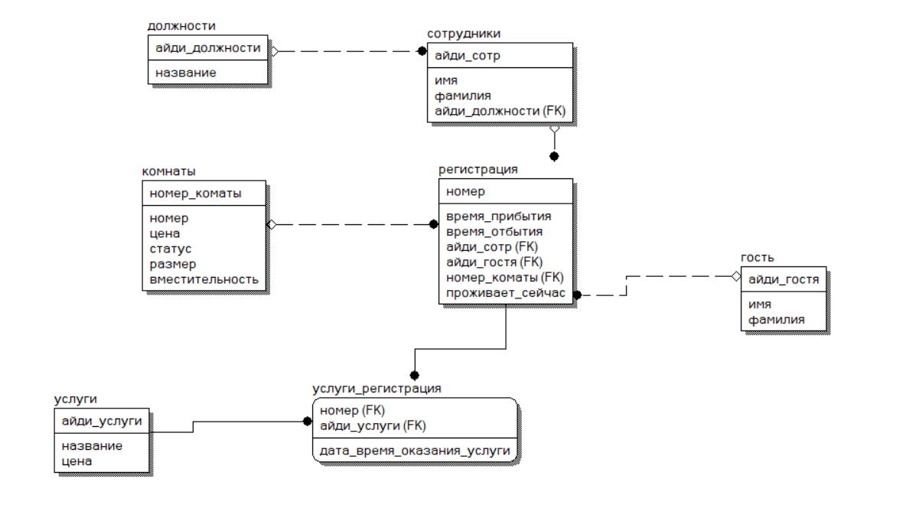

# Работа для курсовой на тему "гостиничный бизнес"
CRM для гостиницы. 
### **Запуск приложения:**
* Для запуска необходим установленный maven + java 17;
* Следующая команда позволит запустить на windows приложение:
```
mvn spring-boot:run "-Dspring-boot.run.arguments=--DB_HOST=<host> --DB_PORT=<port> --DB_NAME=<db-name> --DB_PASSWORD=<password> --DB_USERNAME=<username> --LOG_LEVEL=<log_level>"
```
Структура БД:
